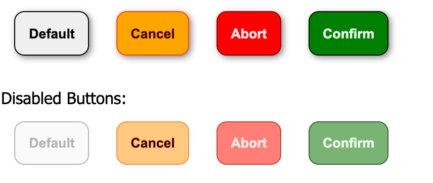

# CTA Button Exercise

(CSS + Props)

- Apply one general styling to the Button using scoped CSS
- Use the props ‘type’ to apply correct stylings, when button type is
  - 'confirm', the button should have a green background color
  - 'cancel', the background color should be orange
  - 'abort', the background color should be red
- use property ‘type’ to pass the type to the `<Button>` component
- [EXTRA] pass also the ‘title’ within props to `<Button>`
- [EXTRA] make sure disabled buttons are recognizable by users

